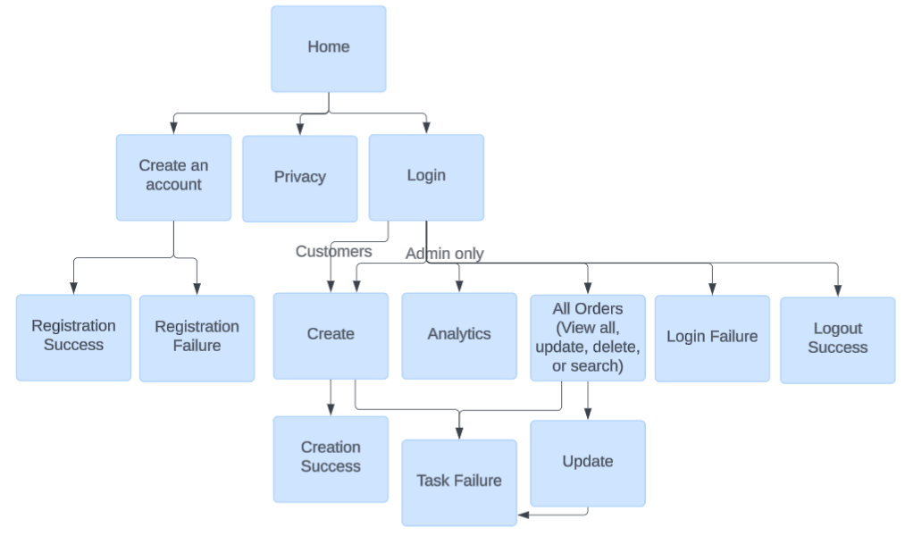

# My Senior Project Portfolio

## Flower Planting Order Management Application

### Project Overview

The Flower Planting Order Management Application manages a database of flower planting orders, specifically designed and customized for a local small business. 
In order to maintain the business privacy, all names and details are sample information. For the purposes of this project, I have called the business John and Sons, Inc. 

The main objective of this application is to manage the flower planting orders, which includes accepting orders, saving them, organizing them, and providing them in logical formats to the administrators. 
It provides a user interface that guides customers through the flower planting order process, and it guides administrators through order creation, updates, deletions, searches, and analytics.

This application’s database and easy-to-use interface to manage the order information will improve the administration tasks of the business by making order tracking smoother and more efficient. This project simplifies the ordering process, which results in multiple benefits, including more effcient time management, ease and simplicity in the tasks, reduced management costs, and improved communicate between the business and its customers. 

### Design Approach & Diagrams

This project involved a hybrid approach between the traditional Waterfall and the Agile Scrum implementation methodologies. The hybrid management strategy was tailored to fit the specific needs and requirements of this project.

#### Planning Tools:
* [Microsoft](https://www.microsoft.com/en-us/) Word documentation
* [Microsoft](https://www.microsoft.com/en-us/) Word templates
* [Microsoft](https://www.microsoft.com/en-us/) Excel
* Sprint back log chart
* Gantt project schedule
* [LucidChart](https://www.lucidchart.com/pages) for creating diagrams
* [Bootswatch](https://bootswatch.com/) Bootstrap guides
* Forums on [Halo Learn](halo.gcu.edu)
* [Pixabay](https://pixabay.com/images/search/) for images

#### Design Plans:
* Flowcharts
* Sitemap
* Wireframes
* UML Class Diagram
* UML System Component Diagram
* UML Deployment Diagram
* UML Activity Diagram
* Architecture Diagram
* High-level Logical Solution Design
* System Design
* Physical Solution Design

#### Technical Approach

This application was developed with Microsoft ASP.NET CORE, with guiding principles such as the n-layer architecture, Model-View-Controller (MVC) pattern, dependency injection, and data access objects and services.

It also uses MySQL for a relational database to efficiently store and manage the data, also offering potential future cloud compatibility. Languages included C#, HTML, CSS, JavaScript, and more. GitHub managed the storage, sharing, and backup code of this project. 
NLogs tracked logs in real-time for monitoring and debugging.

#### Project Features

* Register: New users can register an account
* Login: Returning users and administrators can login
* Create: Users can create a flower planting order
* Update: Administrators can update any orders
* Delete: Administrators can delete any orders
* View All: Administrators can view all the orders and their information
* Search: Administrators can search the database of orders
* Analytics: Administrators can view order analytics performed on the database
* Permissions & Security – Information follows strict business privacy requirements

  

##### Functional Requirements as User Stories

#### Key Diagrams

##### Flowchart

##### Sitemap Diagram

##### Wireframe Diagram
 

##### ER Diagram

##### UML Diagram

---

### Code Snippets

---

### Background of the Project

This project was designed for my Senior Project course, and I chose to develop an application that would support a local small business that purchases and plants flowers for its customers. This project is customized to fit their specific needs. 

The project provides an easy-to-use interface that interacts with the database to solve the problem of difficult management work for the chosen business. It is designed to be user-friendly, offer simple navigation, and direct users where to go and how to continue. It also follows intuitive standards and expectations, such as the registration, login, and form features.

Also, this project solves several inefficient processes by simplifying the ordering management by removing the need for manual printing, mailing, and writing out forms. It will also decrease the time required for order management and reduce the costs involved. This project also allows customers to order easily and quickly through the application, and it will allow business administrators to record and track order information in an efficient manner.

#### Implementation

To ensure the successful completion of my project, I am using a hybrid approach between the traditional Waterfall and the Agile Scrum methodologies. I have created a hybrid management strategy that is tailored to fit the specific needs of this project and meet its requirements.

Throughout both my Senior Project I and Senior Project II courses, I have followed weekly Agile Scrum sprints that align with the waterfall structure of the required project deliverables. This also allowed the flexibility to adapt to any changes needed along the way. I have strived to ensure that all Milestone deliverables are successfully fulfilled with high quality documentation according to the appropriate structure.

Furthermore, during each of the weekly sprints, I take some time to reflect on my progress, analyze any issues that have arisen, address roadblocks, and gather feedback for areas that may need improvement. This takes place in the course discussion forums, and it mirrors an Agile stand-up team meeting. 

Since this project consists of individual projects, I maintain the role of Scrum Master, Product Owner, designer, developer, tester, and more. Therefore, I control the backlogs, project efficiency, project vision, and progress. I have three main stakeholders: the business contact and my professors of Senior Project I and II. I am also in communication with these stakeholders to ensure the proper development and progress of this project. 

I am using a private GitHub repository so that stakeholders may access the project. This also encourages transparency, accountability, and consistency with my stakeholders, and it retains some privacy. 

I created and maintained a detailed user stories document, which drove the requirements and backlog of tasks for this project. 

Through this approach, I have ensured that this project fulfills all its functional, non-functional, and technical requirements so that the business problem is effectively solved with a high-quality application.

#### Requirements to Run/Access the Project

* To access the project, please contact me. For the privacy of the business, this project is protected in a private [Senior Project repository](https://github.com/Parker-Hub/SeniorProject), which I share access by request.
* To run the project, you will need a SQL database set up. Appropriate DDL scripts are accessible in the project repository.
* You will also need tools to run the project, such as with [Visual Studio](https://visualstudio.microsoft.com/).

##### Link to the portfolio
[Senior Project repository](https://github.com/Parker-Hub/SeniorProject)
Access granted by request. 

### Final Project Presentation and Demonstration

<iframe src="https://www.loom.com/embed/4298d949e44e420db8bfaa789a0713b8?sid=05344185-f288-4ce4-9dee-12c38509c234" frameborder="0" webkitallowfullscreen mozallowfullscreen allowfullscreen style="position: absolute; top: 0; left: 0; width: 100%; height: 100%;"></iframe>

<small>Senior Project Portfolio  |  February 2025 - September 2025</small>
